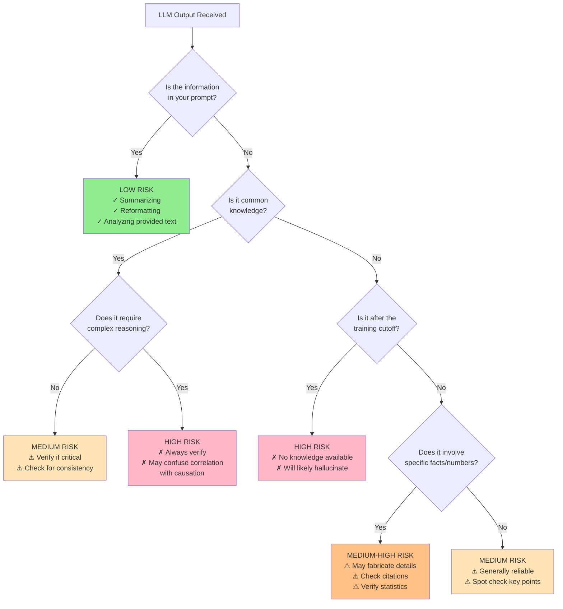

# LLM 101 Workshop: Facilitator's Guide & Additional Materials

This guide provides everything you need to successfully deliver the LLM 101 workshop.

---

## Pre-Workshop Checklist

### 1 Week Before

- [ ] Send pre-read material to all participants
- [ ] Confirm workshop platform (Zoom, Teams, etc.)
- [ ] Test breakout room functionality
- [ ] Prepare shared documents for breakout activities
- [ ] Create participant roster with breakout room assignments
- [ ] Send calendar invites with pre-read attached

### 3 Days Before

- [ ] Send reminder email with:
  - Workshop link
  - Reminder to read pre-read material
  - Request to have laptop/device ready
  - Link to OpenAI tokenizer tool
- [ ] Prepare backup materials in case of tech issues
- [ ] Review and rehearse timing

### Day Before

- [ ] Final technical check (screen sharing, breakout rooms, audio/video)
- [ ] Prepare backup examples in case live demos fail
- [ ] Review participant list for any special accommodations
- [ ] Prepare polls/surveys if using

### Day Of (30 minutes before)

- [ ] Join early and test all systems
- [ ] Open all tools and websites you'll demo
- [ ] Have backup browser tabs ready
- [ ] Test screen sharing
- [ ] Prepare welcome slides or opening screen
- [ ] Enable waiting room if needed

---

## Facilitation Tips

### Creating Psychological Safety

**Opening Statements:**
- "This is a judgment-free zone—there are no silly questions"
- "We're all learning together, including me"
- "If you're confused, others probably are too—please speak up"
- "Technical difficulties happen; we'll work through them"

**Encouraging Participation:**
- Call on quieter participants by name (gently)
- Use "raise hand" features for questions
- Monitor chat actively and read questions aloud
- Acknowledge all contributions positively

### Managing Time

**If Running Behind:**
- Shorten breakout rooms to 10 minutes
- Skip optional advanced topics
- Move detailed questions to end/parking lot
- Reduce sharing time from each group

**If Running Ahead:**
- Ask more discussion questions
- Extend breakout room time
- Include advanced topics
- Allow more time for Q&A

### Handling Different Skill Levels

**For Advanced Participants:**
- Acknowledge their knowledge
- Ask them to share experiences
- Provide extension activities in breakout rooms
- Share advanced reading resources

**For Beginners:**
- Reassure them this is designed for beginners
- Use analogies and simple language
- Check understanding frequently
- Provide visual aids and examples

**For Mixed Groups:**
- Pair advanced with beginners in breakout rooms
- Encourage peer teaching
- Provide activities with varying difficulty
- Offer both basic and advanced follow-up resources

---

## Detailed Section Notes

### Part 1: Welcome & Objectives (5 min)

**Key Messages:**
- Set expectations: hands-on, interactive, safe to ask questions
- Explain the "why": understanding how LLMs work makes you better at using them
- Preview what's coming

**Watch For:**
- Late arrivals (have a 2-minute buffer)
- Tech issues (help in chat or assign someone to help)
- Participant engagement (adjust energy as needed)

---

### Part 2: Tokenization Demo (10 min)

**Common Issues:**

**Problem**: Tokenizer tool is slow or down  
**Solution**: Have screenshots prepared, use alternative tool (Tiktokenizer.app)

**Problem**: Participants can't access the tool  
**Solution**: Do live demo while they watch, share screenshots in chat

**Problem**: Participants don't see the point  
**Solution**: Emphasize cost savings and context limits

**Advanced Questions You Might Get:**

**Q**: "Why do different models use different tokenizers?"  
**A**: "Different design choices about vocabulary size and language coverage. GPT uses BPE, some models use SentencePiece. The principle is the same—breaking text into processable units."

**Q**: "How does the model learn what tokens mean?"  
**A**: "During training! It sees billions of examples of tokens in context and learns their embeddings—we'll cover this more in the next section."

**Q**: "Can I create my own tokenizer?"  
**A**: "Yes, but you'd need to retrain the entire model. Tokenization and embeddings are deeply coupled. For most use cases, you work with existing tokenizers."

**Extension Activity** (if time):
Have participants count tokens in their actual work prompts to see inefficiencies.

---

### Part 3: Transformer Architecture (15 min)

**Teaching Strategy:**
- Start concrete (example sentence) then explain mechanism
- Use consistent example throughout
- Repeat key concepts 3 times in different ways
- Check understanding with quick questions

**Visual Aids:**
If possible, show diagrams of:
- Embedding space (2D projection)
- Attention weights (heatmap)
- Layer-by-layer processing

**Common Misconceptions:**

**Misconception**: "The model has a database of facts"  
**Correction**: "No database! Just billions of learned weights that encode patterns"

**Misconception**: "Attention means the model is 'paying attention' like humans"  
**Correction**: "It's a mathematical operation computing relationships between tokens"

**Misconception**: "The model understands meaning"  
**Correction**: "It has learned statistical patterns that correlate with meaning"

**Advanced Questions You Might Get:**

**Q**: "What are parameters?"  
**A**: "The learned weights in the neural network—billions of numbers that store all the patterns. GPT-3 has 175 billion parameters."

**Q**: "How long does training take?"  
**A**: "Months on thousands of GPUs, costing millions of dollars. That's why most people use pre-trained models."

**Q**: "What's the difference between GPT-3 and GPT-4?"  
**A**: "Primarily scale (more parameters, more training data), architectural improvements, and multimodal capabilities (GPT-4 can process images)."

---

### Part 4: Hallucinations (10 min)

**Key Messages:**
- Hallucinations are a fundamental limitation, not a bug to be fully fixed
- Understanding why helps you know when to trust outputs
- Always verify important information

**Facilitation Notes:**

This section often generates the most discussion because participants have experienced hallucinations firsthand. Be prepared to:
- Share the mic for people's stories
- Keep it moving (easy to spend 20 minutes here)
- Acknowledge frustrations
- End on a constructive note about mitigation

**Collecting Examples:**

If time permits, collect real examples from participants:
- "Type in chat one time you've seen an LLM make a mistake"
- Read 3-4 examples aloud
- Discuss what type of hallucination each represents

**Reframing for Positive Action:**

End this section by focusing on what participants CAN do:
- Verify important facts
- Use LLMs for drafting, not final answers
- Provide context in prompts
- Ask for sources (though they might be made up too!)
- Use retrieval-augmented generation (preview of advanced topics)



---

### Part 5: Breakout Rooms (15 min)

**Setup (2 minutes):**
- Announce group assignments
- Share links to group documents
- Clarify timing: 12 min work + 3 min reporting prep
- Answer any questions before breaking out

**Activity Selection:**

**Use Activity 1 (Tokenization Detective)** if:
- Group is more business/practical focused
- You want concrete, measurable outcomes
- Time is limited

**Use Activity 2 (Hallucination Scenarios)** if:
- Group has experienced many LLM issues
- You want rich discussion
- Participants have varied backgrounds

**Use Activity 3 (Attention Challenge)** if:
- Group is more technical
- You want to reinforce core concepts
- Participants enjoy linguistic puzzles

**During Breakout Rooms:**

- Visit each room for 1-2 minutes
- Check if they understand the task
- Don't solve it for them—guide with questions
- Give 5-minute and 2-minute warnings
- Be available for questions

**If a Group Finishes Early:**
Provide extension questions:
- **For Activity 1**: "What prompts in your daily work could be optimized?"
- **For Activity 2**: "What organizational policies would help?"
- **For Activity 3**: "How does this apply to multilingual prompts?"

**If a Group Is Struggling:**
- Reframe the question
- Give a specific example to start with
- Remind them there's no single right answer
- Encourage them to share initial thoughts

---

### Part 6: Wrap-up (5 min)

**Sharing Back:**

Choose reporting format based on time:
- **If tight on time**: Ask for one key insight per group (30 sec each)
- **If time available**: 60 seconds per group plus Q&A
- **If very short on time**: Skip presentations, put insights in chat

**Key Takeaways Slide/Summary:**

Have this prepared to ensure consistency:
1. Tokenization = text to numbers; efficiency matters
2. Attention = how models understand context
3. Prediction = core mechanism; no knowledge database
4. Hallucinations = systemic; verify important info

**Ending Strong:**

- Thank participants for engagement
- Reinforce what they've learned
- Share next steps clearly
- Invite questions
- Provide way to reach you with follow-up questions

---

## Sample Chat Messages

### Before Starting
```
Welcome! While we wait for everyone, please ensure you can access:
https://platform.openai.com/tokenizer

Test it by typing any sentence and seeing it break into tokens.
```

### During Tokenization Demo
```
Link to tokenizer: https://platform.openai.com/tokenizer

Try this sentence: "The quick brown fox jumps over the lazy dog"

Now try: "Supercalifragilisticexpialidocious"
```

### Before Breakout Rooms
```
Your breakout room assignments:
- Room 1: [names] - Activity 1
- Room 2: [names] - Activity 2
- Room 3: [names] - Activity 3

Links to shared documents:
- Group 1: [link]
- Group 2: [link]
- Group 3: [link]

You have 12 minutes for the activity.
```

### After Workshop
```
Thank you for participating!

Resources shared:
- Pre-read materials: [link]
- Tokenizer tool: https://platform.openai.com/tokenizer
- References: [link]

Follow-up questions: [your email]

Survey link: [if applicable]
```

---

## Troubleshooting Guide

### Technical Issues

**Problem**: Participant can't hear  
**Solution**: Check their audio settings, suggest restart, continue with chat participation

**Problem**: Screen share not working  
**Solution**: Have backup screenshots, describe verbally, share links for participants to try

**Problem**: Breakout rooms not working  
**Solution**: Use main room with manual grouping, assign activities via chat

**Problem**: Tool/website down  
**Solution**: Use screenshots, defer to homework, use alternative tool

### Content Issues

**Problem**: Participant argues LLMs do have knowledge  
**Solution**: Acknowledge their perspective, clarify distinction between statistical patterns and symbolic knowledge, suggest reading on the topic

**Problem**: Too many advanced questions  
**Solution**: Acknowledge value, create parking lot for post-workshop, suggest advanced resources

**Problem**: Complete beginners are lost  
**Solution**: Slow down, use more analogies, pair with advanced participants in breakout

**Problem**: Discussion goes off-topic  
**Solution**: Acknowledge interesting point, commit to discussing after, refocus on objectives

### Engagement Issues

**Problem**: No one participating  
**Solution**: Call on specific people (gently), ask easier questions, share your own experiences first

**Problem**: One person dominating  
**Solution**: Thank them, redirect to others: "Great point—let's hear from someone who hasn't spoken yet"

**Problem**: Silent breakout rooms  
**Solution**: Provide more structured prompts, assign roles (facilitator, note-taker), visit rooms more frequently

---

## Advanced Topic Extensions

If you have extra time or highly technical audience, consider adding:

### Context Windows
"Models can only process a limited number of tokens at once—called the context window. GPT-3.5 handles ~4K tokens, GPT-4 can handle 8K-128K depending on version. This is why long conversations eventually 'forget' early parts."

### Fine-Tuning vs. Pre-Training
"Pre-training: Learning general language patterns on massive data (months, millions of dollars). Fine-tuning: Adapting pre-trained model to specific tasks (hours, much cheaper). When you use ChatGPT, you're using a fine-tuned model."

### Prompt Engineering Principles
"Now that you understand tokenization and attention, some prompt engineering tips make more sense:
- Put important info at beginning or end (attention focuses there)
- Be concise (saves tokens, focuses attention)
- Give examples (helps model predict the pattern)
- Specify format (guides the prediction)"

### Retrieval-Augmented Generation (RAG)
"One solution to hallucinations: Give the model access to a knowledge base. When you ask a question, the system first retrieves relevant documents, then includes them in the prompt. The model can then ground its answer in provided text."

---

## Assessment & Feedback

### Quick Knowledge Check Questions

Use these to gauge understanding:

1. "In your own words, what is a token?"
2. "Why can't LLMs have perfect memory of entire conversations?"
3. "What's the core mechanism that allows LLMs to understand context?"
4. "True or False: LLMs have a database of facts they look up"
5. "Name one reason why hallucinations happen"

### Post-Workshop Survey Template

**Rate 1-5:**
1. How well do you understand how LLMs process language?
2. How well do you understand why hallucinations occur?
3. How useful were the hands-on activities?
4. How likely are you to apply this knowledge in your work?
5. How would you rate the overall workshop?

**Open-ended:**
6. What was the most valuable thing you learned?
7. What topic would you like explored more deeply?
8. What could be improved about this workshop?
9. What questions do you still have?

### Signs of Success

You've succeeded if participants can:
- Explain tokenization in simple terms
- Understand why LLMs generate text token-by-token
- Identify situations where hallucinations are likely
- Write more efficient prompts considering tokens
- Think critically about LLM outputs

---

## Follow-Up Materials

### Email Template: 24 Hours After

**Subject**: LLM 101 Workshop - Resources & Next Steps

Hi everyone,

Thank you for participating in yesterday's LLM 101 workshop! It was great to see such engagement and thoughtful questions.

**Key Resources:**
- Workshop materials: [link]
- Reference list: [link]  
- Tokenizer tool: https://platform.openai.com/tokenizer

**Quick Recap:**
- Tokenization breaks text into processable units
- Attention mechanisms allow models to understand context
- LLMs predict tokens based on patterns, not knowledge databases
- Hallucinations result from the prediction-based architecture

**Next Steps:**
- Experiment with the tokenizer on your own prompts
- Notice when LLMs might be hallucinating in your work
- Join us for the next workshop: [details if applicable]

**Questions?** Reply to this email anytime.

Looking forward to continuing the learning journey with you!

[Your name]

---

### Recommended Next Workshop Topics

Based on this foundation, consider:

**LLM 102: Advanced Prompt Engineering**
- Chain-of-thought prompting
- Few-shot learning
- Structured outputs
- System messages and roles

**LLM 103: Building LLM Applications**
- APIs and integration
- RAG (Retrieval-Augmented Generation)
- Fine-tuning basics
- Evaluation and testing

**LLM 104: Responsible AI & Ethics**
- Bias in LLMs
- Privacy and data concerns
- Security considerations
- Organizational policies

---

## Additional Resources for Facilitators

### Books
- "Build a Large Language Model (From Scratch)" - Sebastian Raschka
- "Natural Language Processing with Transformers" - Lewis Tunstall et al.

### Online Courses
- Stanford CS324: Large Language Models
- Hugging Face NLP Course
- DeepLearning.AI: Generative AI with LLMs

### Communities
- Hugging Face Forums
- r/MachineLearning on Reddit
- AI Discord servers
- LinkedIn AI communities

### Staying Current
- Sebastian Raschka's Newsletter
- Import AI Newsletter
- OpenAI, Anthropic, Google AI blogs
- Papers with Code

---

## Version History

**v1.0** (October 26, 2025)
- Initial workshop development
- 30-min pre-read + 60-min live session
- Three breakout activities included
- 80+ references compiled

---

## License & Attribution

This workshop content is designed for educational purposes. When adapting:
- Credit original sources from reference list
- Maintain educational focus
- Share improvements with community

---

## Contact & Support

**For questions about facilitating this workshop:**
[Your contact information]

**For technical issues with materials:**
[Support contact]

**For content suggestions:**
[Feedback channel]

---

**Ready to facilitate? You've got this!**

Remember: The best facilitators are authentic, adaptable, and genuinely curious along with their participants. Good luck!
