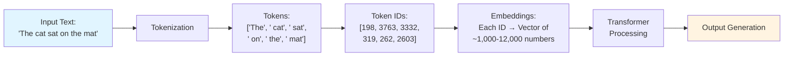
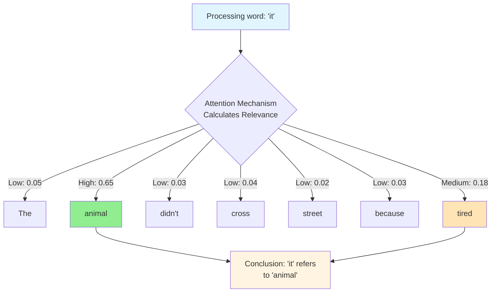
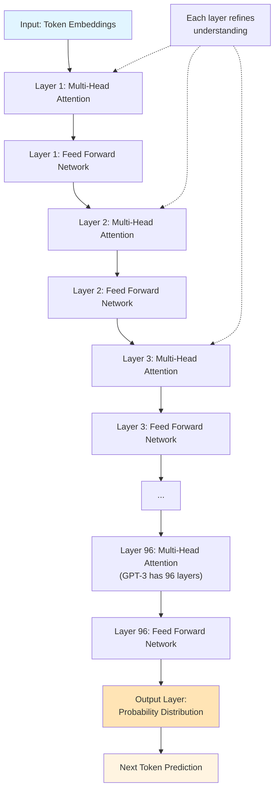
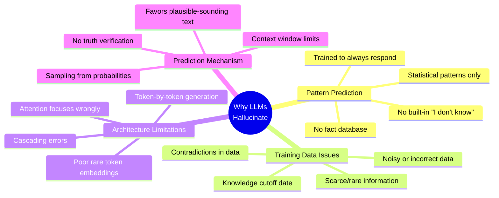

# LLM 101 Workshop: Pre-Read Material
**Estimated Reading Time: 30 minutes**

## Welcome!

This pre-read will prepare you for our hands-on workshop on how Large Language Models (LLMs) work. You already know how to *use* tools like ChatGPT, but in this workshop series, we'll explore what's happening under the hood. This foundational knowledge will help you understand capabilities, limitations, and best practices when working with LLMs.

---

## 1. Why Language Understanding Is Hard for Machines

### The Human Advantage

When you read "The bank was steep," your brain instantly knows this refers to a riverbank, not a financial institution. You understand this through:
- **Context**: What came before and after
- **World knowledge**: Banks of rivers can be steep
- **Common sense**: Money doesn't have a physical slope

Machines don't naturally have any of these abilities.

### Key Challenges for Computers

**Ambiguity**  
Words and phrases often have multiple meanings. "I saw her duck" could mean you saw her pet bird or watched her bend down quickly.

**Context Dependency**  
The word "cool" means different things in "The weather is cool" vs. "That's a cool idea" vs. "Let it cool down."

**Implicit Information**  
Humans communicate with implied meaning. "Can you pass the salt?" isn't really asking about your ability—it's a polite request.

**Language Variations**  
Idioms, slang, dialects, and cultural references make language even more complex. "It's raining cats and dogs" doesn't involve any animals.

**Why This Matters**: LLMs must somehow learn to navigate all these complexities using only patterns in text data.

---

## 2. How Machines Process Language: Tokens, Embeddings & Vocabulary

### From Text to Numbers: Tokenization

Computers can only work with numbers, so text must be converted. This process is called **tokenization**—breaking text into smaller units called **tokens**.

**Example**: The sentence "Humpty Dumpty sat on a wall"

Might become tokens like:
```
["Hum", "pty", " Dum", "pty", " sat", " on", " a", " wall"]
```

**Key Points**:
- Tokens aren't always whole words—they can be parts of words (subwords) or even individual characters
- Common words usually get their own token: "the", "and", "is"
- Rare or long words are split into pieces: "unbelievable" might become ["un", "believ", "able"]
- This helps the model handle words it's never seen before

**Why Subwords?**  
If we used whole words only, the vocabulary would be enormous (millions of words), and the model couldn't handle new or misspelled words. Subword tokenization strikes a balance between efficiency and flexibility.

### Vocabulary: The Model's Dictionary

Every LLM has a **vocabulary**—a fixed list of all possible tokens it knows, typically 30,000-100,000+ tokens. Each token gets a unique number (ID).

**Example Vocabulary (simplified)**:
```
Token ID 1: "the"
Token ID 2: "cat"
Token ID 15: "Dum"
Token ID 16: "pty"
```

The sentence becomes a sequence of numbers: [15, 16, 2, ...] that the model can process.

### Embeddings: Capturing Meaning

Raw token IDs don't tell the model anything about meaning. Token #42 and Token #1,337 are just arbitrary numbers. We need to give each token a **representation** that captures its meaning and relationships to other tokens.

This is where **embeddings** come in. An embedding is a list of numbers (a vector) that represents a token's meaning in "semantic space."

**Think of it like coordinates on a map:**
- "king" might be at position [0.2, 0.8, -0.5, 0.3, ...]
- "queen" might be at position [0.3, 0.7, -0.4, 0.4, ...]
- "car" might be at position [-0.8, 0.1, 0.6, -0.2, ...]

In this high-dimensional space:
- **Similar meanings = close together**: "king" and "queen" are near each other
- **Different meanings = far apart**: "king" and "car" are distant
- **Relationships are captured**: The vector from "king" to "queen" is similar to the vector from "man" to "woman"

**Key Insight**: These embeddings aren't hand-coded—the model learns them during training by processing billions of words and figuring out which words appear in similar contexts.

### Putting It Together

**The Pipeline**:
1. **Input text**: "The cat sat on the mat"
2. **Tokenization**: ["The", " cat", " sat", " on", " the", " mat"]
3. **Token IDs**: [198, 3763, 3332, 319, 262, 2603]
4. **Embeddings**: Each ID becomes a vector of ~1,000-12,000 numbers
5. **Processing**: The model works with these vectors to understand and generate text



---

## 3. The Transformer: The Engine Behind LLMs

### What Makes Transformers Special?

The **Transformer** is the architecture (blueprint) that powers modern LLMs like GPT, Claude, and Gemini. Introduced in 2017, it revolutionized AI because it could:
- Process entire sentences in parallel (not word-by-word)
- Capture relationships between words regardless of distance
- Scale to enormous sizes with billions of parameters

### The Core Idea: Attention

The breakthrough innovation is the **attention mechanism**. When the model processes each word, attention allows it to "look at" and consider all other words in the sentence.

**Example**: "The animal didn't cross the street because it was too tired"

When processing "it," the attention mechanism helps the model figure out:
- What does "it" refer to?
- By "attending to" different words, the model realizes "it" relates more strongly to "animal" than to "street"
- This contextual understanding is crucial for making sense of the sentence



### Multi-Head Attention: Multiple Perspectives

Instead of one attention mechanism, transformers use many in parallel (**multi-head attention**). Each "head" can focus on different relationships:
- **Head 1**: Might learn grammatical relationships (subject-verb agreement)
- **Head 2**: Might learn semantic relationships (synonyms, antonyms)
- **Head 3**: Might learn positional relationships (nearby words)

Having multiple heads allows the model to capture rich, nuanced understanding.

### The Architecture in Simple Terms

**Encoder-Decoder vs. Decoder-Only**:
- **Encoder-Decoder**: Used for tasks like translation (read input, generate output)
- **Decoder-Only**: Used for LLMs like GPT (generate text by predicting next word)

**For most LLMs you use (GPT, Claude, etc.), they are decoder-only models.**

**How It Works (Simplified)**:

1. **Input**: Your prompt becomes a sequence of embeddings
2. **Layers of Processing**: The embeddings pass through many transformer layers (GPT-3 has 96 layers!)
   - Each layer applies attention and processing to refine understanding
   - Information flows through the layers, with each adding more sophisticated understanding
3. **Prediction**: At the end, the model predicts the most likely next token
4. **Generation**: This process repeats—each predicted token is added to the input, and the model predicts the next one
5. **Output**: Token by token, a complete response is generated

**Key Concept**: LLMs are fundamentally **prediction machines**. They predict the next word based on all previous words, using patterns learned from massive amounts of training data.



---

## 4. LLM Limitations and Hallucinations

### What Are Hallucinations?

A **hallucination** is when an LLM generates information that:
- Sounds plausible and confident
- Is factually incorrect or made up
- Cannot be traced to the training data

**Example**:
- **User**: "What did the 2023 New England Journal of Medicine study say about chocolate curing migraines?"
- **Hallucinated Response**: "The landmark 2023 NEJM study by Dr. Sarah Chen found that dark chocolate consumption reduced migraine frequency by 47% in a trial of 2,340 patients."
- **Reality**: This study doesn't exist. The journal, author, statistics, and findings are all fabricated, but the response sounds authoritative and specific.

### Why Do LLMs Hallucinate?

**1. They Don't "Know" Things—They Predict Patterns**  
LLMs don't have a database of facts. They've learned statistical patterns in text. When asked a question, they generate what sounds like a plausible answer based on those patterns, even if it's wrong.

**2. Training Data Issues**  
- **Insufficient or scarce data**: If a topic appears rarely in training data, the model is more likely to make mistakes
- **Noisy data**: Errors, contradictions, and misinformation in training data get learned
- **Knowledge cutoff**: The model knows nothing about events after its training data ended

**3. The Prediction Mechanism**  
During training, models learn to always generate *some* response. They're incentivized to "take their best guess" even when uncertain. There's no built-in mechanism to say "I don't know."

**4. Attention Limitations**  
The attention mechanism can sometimes focus on the wrong information, leading to responses that diverge from the correct context.

**5. Cascading Errors**  
LLMs generate one token at a time. If an early token is slightly off, subsequent tokens build on that error, creating increasingly wrong responses.

### Where Hallucinations Occur in the Architecture

- **Tokenization**: Incorrect token splitting can distort meaning
- **Embeddings**: Poor representation of rare tokens can cause confusion
- **Attention layers**: Focusing on wrong context leads to errors
- **Output generation**: The probability distribution over next tokens can favor plausible-sounding but incorrect options



### Key Limitations to Remember

**LLMs cannot:**
- Access real-time information (without external tools)
- Perform true reasoning or logical deduction
- Verify facts against a database
- Know when they're wrong
- Understand personal or private information (unless you provide it)

**LLMs are good at:**
- Pattern matching and completion
- Generating fluent, grammatical text
- Summarizing and rephrasing
- Following instructions (when clear)
- Working with information in the prompt (context)

---

## Glossary

**Attention Mechanism**: A technique that allows the model to focus on relevant parts of the input when processing each token

**Decoder**: The part of a transformer that generates output text, one token at a time

**Embedding**: A numerical vector representation of a token that captures its meaning and relationships to other tokens

**Encoder**: The part of a transformer that processes and understands input text (not used in models like GPT)

**Hallucination**: When an LLM generates plausible-sounding but factually incorrect information

**Multi-Head Attention**: Using multiple attention mechanisms in parallel to capture different types of relationships

**Parameters**: The learned weights in a neural network (billions of numbers that store the model's knowledge)

**Token**: A unit of text (word, subword, or character) that the model processes

**Tokenization**: The process of breaking text into tokens

**Transformer**: The neural network architecture that powers modern LLMs

**Vocabulary**: The complete set of tokens that a model can recognize and use

---

## Prepare for the Workshop

In our live session, you'll:
1. **Hands-on experiment**: See tokenization in action with real tools
2. **Visualize attention**: Understand how models "read" sentences
3. **Group discussion**: Explore real-world hallucination examples
4. **Breakout activities**: Apply concepts to practical scenarios

**Questions to think about:**
- When have you noticed ChatGPT or similar tools make mistakes?
- What types of tasks do you find LLMs excel at vs. struggle with?
- How might understanding tokenization change how you write prompts?

See you at the workshop!
