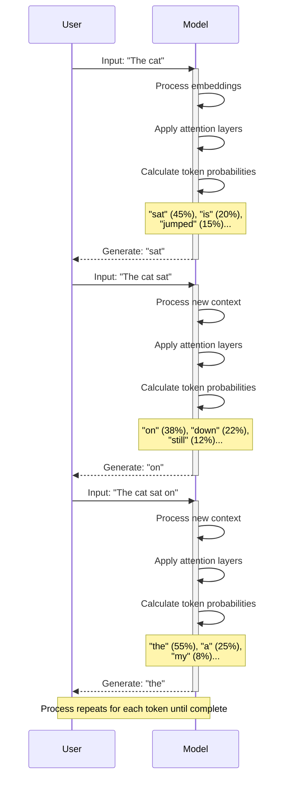

# LLM 101 Workshop

Understanding How Large Language Models Work

**Duration: 60 minutes**

<div class="pt-12">
  <span @click="$slidev.nav.next" class="px-2 py-1 rounded cursor-pointer" hover="bg-white bg-opacity-10">
    Press Space to start <carbon:arrow-right class="inline"/>
  </span>
</div>

<!--
Welcome participants as they join. Ensure everyone can see the presentation clearly.
Ground rules: Questions welcome anytime, we'll learn by doing, no question is too basic.
-->

---
layout: default
---

# Today's Agenda

<div class="grid grid-cols-2 gap-4">

<div>

| Time | Topic |
|------|-------|
| 0-5 min | Welcome & Objectives |
| 5-15 min | Interactive Tokenization Demo |
| 15-30 min | Understanding the Transformer |

</div>

<div>

| Time | Topic |
|------|-------|
| 30-40 min | Hallucinations Deep Dive |
| 40-55 min | Breakout Room Activities |
| 55-60 min | Wrap-up & Q&A |

```mermaid
gantt
    title LLM 101 Workshop Timeline
    dateFormat mm
    axisFormat %M min

    section Session
    Welcome & Objectives           :a1, 00, 5m
    Interactive Tokenization Demo  :a2, 05, 10m
    Understanding Transformer      :a3, 15, 15m
    Hallucinations Deep Dive       :a4, 30, 10m
    Breakout Room Activities       :a5, 40, 15m
    Wrap-up & Q&A                  :a6, 55, 5m
```

</div>

</div>

<div class="mt-8">



</div>

<!--
Quick overview of the session flow. Emphasize that this will be interactive and hands-on, not just a lecture.
Point out the visual timeline to help participants understand pacing.
-->

---
layout: center
class: text-center
---

# What You'll Learn Today

<div class="grid grid-cols-2 gap-8 mt-8">

<div v-click>

## 🔤 Tokenization
See how models break down language

</div>

<div v-click>

## 🧠 Transformer Architecture
The "brain" behind LLMs

</div>

<div v-click>

## ⚠️ Hallucinations
Why they happen and how to spot them

</div>

<div v-click>

## 🎯 Hands-on Practice
Apply your learning through activities

</div>

</div>

<!--
Set expectations clearly. By the end, participants should understand not just WHAT LLMs do, but HOW they do it.
Use the click animations to reveal each learning objective one at a time.
This knowledge will change how they interact with these tools.
-->

---
layout: section
---

# Part 1: Interactive Tokenization Demo

---
layout: center
class: text-center
---

# Let's See Tokenization in Action

<div class="text-4xl mt-12 mb-8">
🔗 https://platform.openai.com/tokenizer
</div>

This is OpenAI's official tokenizer tool
We'll see how LLMs actually "see" text

<!--
Give everyone 30 seconds to open the tool. Paste the URL in chat as well.
Ensure everyone has the tool loaded before proceeding.
Make sure to share your screen showing the tokenizer for those who can't access it.
-->

---

# Activity 1: Basic Tokenization

<div class="text-center mt-8">

## Try this sentence:

<div class="text-3xl my-8 font-bold text-blue-400">
"The quick brown fox jumps over the lazy dog"
</div>

</div>

<div v-click class="mt-8">

### What do you notice?

<v-clicks>

- ✅ Each common word gets its own token
- ✅ Spaces are included in tokens
- ✅ Total: **10 tokens**

</v-clicks>

</div>

<!--
Guide the discussion. Ask participants to share what they observe in chat.
Key point: Common words are usually single tokens.
This is the foundation - simple, common English words map cleanly to tokens.
-->

---

# Activity 1: Long Words

<div class="text-center mt-8">

## Now try:

<div class="text-2xl my-8 font-bold text-purple-400">
"Supercalifragilisticexpialidocious"
</div>

</div>

<div v-click class="mt-8">

### What happens?

<v-clicks>

- 🔀 Long/rare words split into **multiple subword tokens**
- 💡 This is why LLMs can handle words they've never seen
- 🧩 They break them into familiar pieces!

</v-clicks>

</div>

<!--
This is a key insight: tokenization allows models to handle unknown words.
The word breaks into recognizable subword units.
This is called "subword tokenization" and it's crucial for the model's flexibility.
-->

---

# Activity 2: Comparing Languages

<div class="grid grid-cols-3 gap-4 mt-8">

<div>

### 🇬🇧 English
"Hello, how are you today?"

<div v-click class="text-2xl font-bold text-green-400 mt-4">
~6 tokens
</div>

</div>

<div>

### 🇩🇪 German
"Hallo, wie geht es dir heute?"

<div v-click class="text-2xl font-bold text-yellow-400 mt-4">
~7 tokens
</div>

</div>

<div>

### 🇨🇳 Chinese
"你好，你今天怎么样？"

<div v-click class="text-2xl font-bold text-red-400 mt-4">
~12-15 tokens
</div>

</div>

</div>

<div v-click class="mt-12 p-4 bg-blue-500 bg-opacity-20 rounded">

**Key Insight:** Most tokenizers were optimized for English. Non-Latin scripts require more tokens for the same meaning, affecting both **cost** and **context window usage**.

</div>

<!--
This affects both cost and context window usage. Important for multilingual applications.
Allow time for participants to test all three languages.
This is a real consideration for global applications - Chinese users will use more tokens for the same content.
-->

---

# Activity 3: Prompt Engineering Implications

<div class="grid grid-cols-2 gap-8 mt-8">

<div>

### Version 1: Verbose

<div class="p-4 bg-red-500 bg-opacity-20 rounded text-sm">

"I would really appreciate it if you could please help me understand this concept"

</div>

<div v-click class="mt-4 text-xl font-bold text-red-400">
⚠️ More tokens = Higher cost
</div>

</div>

<div>

### Version 2: Concise

<div class="p-4 bg-green-500 bg-opacity-20 rounded text-sm">

"Please explain this concept"

</div>

<div v-click class="mt-4 text-xl font-bold text-green-400">
✅ Fewer tokens = More efficient
</div>

</div>

</div>

<div v-click class="mt-12">

### Why does this matter?
More tokens = higher cost + less room for actual content

</div>

<!--
Guide to conclusion: More tokens = higher cost and less room for actual content.
Being concise isn't just good writing—it's efficient use of the model's attention.
This is practical advice they can use immediately.
-->

---
layout: center
class: text-center
---

# Tokenization Key Takeaway

<div class="text-left mt-12 text-xl">

**Tokens are the fundamental unit LLMs work with**

<v-clicks>

- 🔢 Every word becomes tokens
- ⚙️ Models process them one by one
- 📝 Understanding this helps you write better prompts
- 💰 Efficient prompts save money and context space

</v-clicks>

</div>

<!--
Summarize before moving to the next section. Check for questions.
This foundation is critical for understanding the rest of the workshop.
Make sure everyone grasps this before moving on - it's the building block for everything else.
-->

---
layout: section
---

# Part 2: Understanding the Transformer

---

# After Tokenization: The Transformer

<div class="text-center text-2xl my-12 p-6 bg-blue-500 bg-opacity-20 rounded">

**Example sentence:**
"The cat sat on the mat because it was comfortable"

</div>

<div class="text-center text-xl">

We'll follow this through the transformer architecture
**step by step**

</div>

<!--
Use this single example throughout the entire transformer explanation.
Consistency helps participants follow the flow.
Write this sentence somewhere visible or keep coming back to this slide.
-->

---

# Step 1: Embeddings

<div class="mt-8">

Each token becomes an **embedding** - a list of hundreds or thousands of numbers representing its meaning.

</div>

<div class="grid grid-cols-2 gap-8 mt-12">

<div>

### Think of it like coordinates:

<v-clicks>

- "cat" → `[0.2, 0.8, -0.3, ...]`
- "dog" → `[0.3, 0.7, -0.2, ...]`
  <span class="text-sm text-green-400">↑ close to "cat"</span>
- "car" → `[-0.8, 0.1, 0.5, ...]`
  <span class="text-sm text-red-400">↑ far from "cat"</span>

</v-clicks>

</div>

<div v-click>

### Visual representation:

```
    dog •
    cat •


              • car
```

Words with similar meanings are close in multi-dimensional space

</div>

</div>

<div v-click class="mt-8 text-center text-lg">

The model **learns** these positions from billions of sentences during training

</div>

<!--
Use the spatial metaphor: words with similar meanings are close in this multi-dimensional space.
This is learned, not programmed - no human told it that dog and cat are similar.
The model figured this out by seeing them used in similar contexts.
-->

---

# Step 2: Attention Mechanism

<div class="text-center mb-8">

When processing the word **"it"**, the attention mechanism looks at ALL other words to figure out what "it" refers to.

</div>

<div class="grid grid-cols-2 gap-8">

<div>

### How related is "it" to:

<v-clicks>

- "The"? → <span class="text-gray-400">Low relevance</span>
- "cat"? → <span class="text-green-400 font-bold">High relevance ✓</span>
- "sat"? → <span class="text-gray-400">Low relevance</span>
- "mat"? → <span class="text-yellow-400">Medium relevance</span>
- "comfortable"? → <span class="text-green-400 font-bold">High relevance ✓</span>

</v-clicks>

</div>

<div v-click>

### Result:

The model focuses on **"cat"** and **"comfortable"** to understand **"it"**.

<div class="mt-8 p-4 bg-purple-500 bg-opacity-20 rounded text-sm">

This is the **magic of attention** - the model learns which words to focus on for understanding context.

</div>

</div>

</div>

<!--
This is the magic of attention. Ask: "What if the sentence was 'The cat sat on the mat because IT was dusty'?"
The attention would shift to "mat". This shows how context changes everything.
Spend time here - this is the core innovation of transformers.
-->

---

# Interactive Question

<div class="text-center mt-16">

<div class="text-2xl mb-8">

What if the sentence was:

</div>

<div class="text-3xl font-bold text-yellow-400 p-6 bg-yellow-500 bg-opacity-10 rounded">

"The cat sat on the mat because it was dusty"

</div>

<div v-click class="text-2xl mt-12">

What should **"it"** refer to now?

</div>

<div v-click class="text-4xl mt-8 text-green-400">

→ The **mat**!

</div>

</div>

<!--
Take responses from participants. The point is that attention would shift to "mat".
This demonstrates that attention is context-dependent and dynamic.
Same word "it", same sentence structure, but different context words change the meaning.
-->

---

# Step 3: Multi-Head Attention

<div class="mt-8">

The model doesn't just do this once - it has **multiple "attention heads"** running in parallel:

</div>

<div class="grid grid-cols-3 gap-4 mt-12">

<div v-click class="p-4 bg-blue-500 bg-opacity-20 rounded">

### Head 1
Focuses on **grammar**
(subjects and verbs)

</div>

<div v-click class="p-4 bg-green-500 bg-opacity-20 rounded">

### Head 2
Focuses on **semantic meaning**
(related concepts)

</div>

<div v-click class="p-4 bg-purple-500 bg-opacity-20 rounded">

### Head 3
Focuses on **sentence structure**
(clauses and phrases)

</div>

</div>

<div v-click class="mt-12 text-center text-2xl">

**GPT-3:** 96 layers × 96 attention heads =
<span class="text-4xl font-bold text-red-400">9,216 attention mechanisms!</span>

</div>

<!--
Each head specializes in different aspects. They work in parallel to build a rich understanding.
This is why transformers are so powerful but also computationally expensive.
The different heads learn different things automatically during training - not programmed by humans.
-->

---

# Step 4: Prediction

<div class="mt-8">

After all the processing:

</div>

<v-clicks>

<div class="flex items-center gap-4 mt-6">
<div class="text-3xl">1️⃣</div>
<div>Model has rich understanding of context</div>
</div>

<div class="flex items-center gap-4 mt-4">
<div class="text-3xl">2️⃣</div>
<div>Predicts probabilities for next token</div>
</div>

<div class="flex items-center gap-4 mt-4">
<div class="text-3xl">3️⃣</div>
<div>Example output: <span class="font-mono text-green-400">"and" (25%), "The" (15%), "so" (12%)...</span></div>
</div>

<div class="flex items-center gap-4 mt-4">
<div class="text-3xl">4️⃣</div>
<div>Samples from these probabilities</div>
</div>

<div class="flex items-center gap-4 mt-4">
<div class="text-3xl">5️⃣</div>
<div>Adds chosen token and repeats</div>
</div>

</v-clicks>

<div v-click class="mt-8 text-center text-xl p-4 bg-yellow-500 bg-opacity-20 rounded">

**This is why you see text streaming in token by token!**

</div>

<!--
Emphasize: There's no pre-written answer. It's genuinely generating token by token.
The streaming effect you see is this process happening in real-time.
Each token generation goes through this entire process.
-->

---

# Token Generation Flow



<!--
Walk through this step-by-step. The key insight: each new token changes the context for the next prediction.
This is autoregressive generation - each token depends on all previous tokens.
Point out how the entire sequence is reprocessed each time, but modern systems cache earlier computations for efficiency.
-->

---
layout: center
---

# Live Demo Time

<div class="text-center mt-12">

I'll use the same prompt multiple times:

<div class="text-2xl my-8 p-6 bg-blue-500 bg-opacity-20 rounded">

"Complete this sentence: The most surprising thing about artificial intelligence is"

</div>

<div v-click class="text-xl">

Notice how each completion is different?
The model is genuinely sampling from probability distributions.

</div>

</div>

<!--
Share your screen and run this prompt 3-4 times. Show the variety in outputs.
Point out that there's no single "correct" answer - it's all probabilistic.
If time permits, discuss temperature parameter briefly (low temp = more deterministic, high temp = more random).
-->

---
layout: center
class: text-center
---

# Transformer Key Takeaway

<div class="text-left mt-12 text-xl">

**LLMs are sophisticated prediction machines**

<v-clicks>

- ❌ They don't "know" facts
- 🎲 They predict likely next tokens based on patterns
- 📚 Patterns learned from massive amounts of training text
- ⚠️ No built-in understanding of truth or accuracy

</v-clicks>

</div>

<div v-click class="mt-12 p-4 bg-red-500 bg-opacity-20 rounded text-center">

This is crucial for understanding hallucinations!

</div>

<!--
This is crucial for understanding hallucinations. The model is optimized for plausible continuation, not factual accuracy.
Check for questions before moving to hallucinations.
Make sure this point lands - it's the bridge to the next section.
-->

---
layout: section
---

# Part 3: Hallucinations Deep Dive

---
layout: center
---

# What Are Hallucinations?

<div class="text-center mt-16 text-2xl">

When LLMs generate **plausible-sounding** but
**incorrect or fabricated** information

</div>

<div v-click class="mt-12 text-xl">

Let's look at real examples to understand why this happens

</div>

<!--
Set the stage: Hallucinations are not bugs, they're a fundamental characteristic of how these models work.
Understanding WHY helps us use them better.
This follows naturally from the "prediction machines" insight.
-->

---

# Example 1: Confident But Wrong

<div class="grid grid-cols-2 gap-8 mt-8">

<div>

### User asks:
<div class="p-4 bg-blue-500 bg-opacity-20 rounded text-sm">

"What are the main health benefits of drinking hydrated water?"

</div>

### LLM responds:
<div class="p-4 bg-green-500 bg-opacity-20 rounded text-sm mt-4">

"Hydrated water, also known as structured water, has several scientifically proven benefits including improved cellular hydration, enhanced nutrient absorption, and better detoxification. Studies from Stanford University in 2019 showed 34% improvement in cellular function."

</div>

</div>

<div v-click>

### Reality:
<div class="p-4 bg-red-500 bg-opacity-30 rounded text-lg mt-4">

**Everything here is fabricated:**

- ❌ No such thing as "hydrated water"
- ❌ No Stanford study
- ❌ No 34% statistic

</div>

<div class="mt-8 text-xl">

But it SOUNDS authoritative, doesn't it?

</div>

</div>

</div>

<!--
Let this sink in. Ask: "Does this SOUND convincing? Why?"
The answer reveals how hallucinations work: pattern matching without fact-checking.
This is a powerful example because it seems so plausible - that's the danger.
-->

---

# Why Did This Happen?

<v-clicks>

<div class="flex items-start gap-4 mt-8">
<div class="text-3xl">1️⃣</div>
<div>
<strong>Pattern Matching</strong><br/>
The model has seen many sentences like "[X] has scientifically proven benefits including [list]"
</div>
</div>

<div class="flex items-start gap-4 mt-6">
<div class="text-3xl">2️⃣</div>
<div>
<strong>No Fact-Checking</strong><br/>
Can't verify if Stanford did this study or if the number is real
</div>
</div>

<div class="flex items-start gap-4 mt-6">
<div class="text-3xl">3️⃣</div>
<div>
<strong>Confidence Without Knowledge</strong><br/>
Outputs high-probability tokens, not truth
</div>
</div>

<div class="flex items-start gap-4 mt-6">
<div class="text-3xl">4️⃣</div>
<div>
<strong>Trained to Always Answer</strong><br/>
Learned to generate completions, not say "I don't know"
</div>
</div>

</v-clicks>

<!--
Break down each point. The model is doing exactly what it was trained to do: predict plausible next tokens.
It has no mechanism to check facts against reality.
This is not a flaw in the training - it's a fundamental characteristic of the architecture.
-->

---

# Example 2: Historical Complexity

<div class="grid grid-cols-2 gap-8 mt-12">

<div>

### Question:
<div class="text-2xl my-4 p-4 bg-blue-500 bg-opacity-20 rounded">

"What was the capital of Poland in 1800?"

</div>

### Possible LLM answer:
<div class="text-2xl my-4 p-4 bg-green-500 bg-opacity-20 rounded">

"Warsaw"

</div>

</div>

<div>

### Reality:
<div class="p-4 bg-red-500 bg-opacity-30 rounded">

There was **no unified Poland** in 1800 - it was partitioned!

</div>

### Why the error?

<v-clicks>

- ✅ Warsaw IS the capital now (true)
- ✅ It WAS the capital before partition (true)
- ⚠️ Pattern "[capital of X in YEAR]" usually has simple answer
- ❌ Model doesn't reason about complex historical context

</v-clicks>

</div>

</div>

<!--
This shows that LLMs struggle with nuance and complex reasoning.
They pattern-match rather than reason through historical context.
The model knows facts but can't reason about their temporal relationships.
-->

---

# When Are Hallucinations More Likely?

<div class="grid grid-cols-2 gap-8 mt-12">

<div>

<v-clicks>

<div class="flex items-center gap-3 mb-4">
<div class="text-2xl">❌</div>
<div><strong>Information is rare</strong> in training data</div>
</div>

<div class="flex items-center gap-3 mb-4">
<div class="text-2xl">❌</div>
<div><strong>Complex reasoning</strong> is required</div>
</div>

<div class="flex items-center gap-3 mb-4">
<div class="text-2xl">❌</div>
<div><strong>Specific facts</strong> (dates, numbers, names) needed</div>
</div>

</v-clicks>

</div>

<div>

<v-clicks>

<div class="flex items-center gap-3 mb-4">
<div class="text-2xl">❌</div>
<div><strong>Recent events</strong> after training cutoff</div>
</div>

<div class="flex items-center gap-3 mb-4">
<div class="text-2xl">❌</div>
<div>Question <strong>assumes false premises</strong></div>
</div>

</v-clicks>

</div>

</div>

<!--
Go through each point with examples if time permits.
Ask participants to share examples from their experience.
This helps them develop intuition for when to be skeptical.
-->

---
layout: center
---

# Discussion Time

<div class="text-center mt-12 text-2xl">

**Share in chat or speak up:**

When have you encountered hallucinations?

</div>

<div class="grid grid-cols-2 gap-8 mt-12">

<div>

### Common examples:

<v-clicks>

- 📚 Made-up citations or sources
- 💻 Plausible but incorrect technical info
- 🔀 Mixing real and fake facts
- 🔢 Overly specific numbers/dates that are wrong

</v-clicks>

</div>

<div v-click>

### Key questions:

- How can you tell when an LLM might be hallucinating?
- What types of questions are LLMs more likely to get wrong?

</div>

</div>

<!--
Facilitate discussion for 3-4 minutes. Collect examples.
This makes the concept concrete and relatable.
Write down interesting examples to reference later.
-->

---

# How to Spot Potential Hallucinations

<div class="grid grid-cols-2 gap-8 mt-12">

<div>

### 🚩 Red flags:

<v-clicks>

- Overly specific statistics without sources
- Citations you can't verify
- Information about niche/rare topics
- Claims about recent events
- Technical details that sound sophisticated but vague

</v-clicks>

</div>

<div v-click>

### ✅ Best practice:

<div class="text-2xl p-6 bg-green-500 bg-opacity-20 rounded mt-4">

Always verify important information from authoritative sources

</div>

<div class="mt-8 text-lg">

Use LLMs as **assistants**, not **oracles**

</div>

</div>

</div>

<!--
Practical advice. LLMs are great for drafting and brainstorming, but not authoritative sources.
Emphasize: use them as assistants, not oracles.
This is the most actionable takeaway from this section.
-->

---
layout: center
class: text-center
---

# Hallucinations Key Takeaway

<div class="text-left mt-12 text-xl">

**Hallucinations are systemic, not bugs**

<v-clicks>

- ⚙️ Result from prediction-based architecture
- 📊 More likely with rare info or complex reasoning
- ❌ Models have no truth verification mechanism
- ✅ Always verify important information

</v-clicks>

</div>

<div v-click class="mt-12">

<div class="grid grid-cols-2 gap-8">

<div class="p-4 bg-green-500 bg-opacity-20 rounded">

### ✅ Use LLMs for:
- Drafting
- Brainstorming
- Explaining concepts

</div>

<div class="p-4 bg-red-500 bg-opacity-20 rounded">

### ❌ Don't use as:
- Authoritative fact sources
- Medical/legal advice
- Financial guidance

</div>

</div>

</div>

<!--
This reframes hallucinations: not a flaw to fix, but a characteristic to understand.
Proper usage means working with this limitation.
Set clear boundaries for appropriate use cases.
-->

---
layout: section
---

# Part 4: Breakout Room Activities

---

# Time to Apply Your Learning!

<div class="grid grid-cols-3 gap-6 mt-12">

<div class="p-4 bg-blue-500 bg-opacity-20 rounded">

### Activity 1
**Tokenization Detective**

Optimize prompts for token efficiency

</div>

<div class="p-4 bg-green-500 bg-opacity-20 rounded">

### Activity 2
**Hallucination Scenarios**

Identify hallucination risks

</div>

<div class="p-4 bg-purple-500 bg-opacity-20 rounded">

### Activity 3
**Attention Mechanism Challenge**

Understand attention and ambiguity

</div>

</div>

<div class="mt-12 text-center text-xl">

**Format:** 12 minutes work time + 3 minutes reporting

</div>

<!--
Set up breakout rooms now. Ensure each group has a shared document.
Assign activities or let groups choose based on interest.
Visit rooms to check progress and provide guidance.
-->

---

# Activity 1: Tokenization Detective

<div class="text-lg mt-8">

**Objective:** Optimize prompts for token efficiency

**Your task:** Your company has a tight token budget. Optimize this prompt:

</div>

<div class="p-4 bg-gray-700 rounded my-6 text-sm">

"I would greatly appreciate it if you could take some time to thoroughly analyze the following document and provide me with a comprehensive summary that includes all of the most important key points and main ideas that are discussed throughout the entire document."

</div>

<div class="text-lg">

**Goals:**
- Count tokens in the original using the tokenizer
- Rewrite to convey same meaning with fewer tokens
- Aim for 40-50% reduction
- Test your rewrite in the tokenizer

**Discuss:** What did you learn about efficient prompting?

</div>

<!--
Provide this information in a shared document as well.
Expected outcome: "Analyze this document and summarize the key points" (much fewer tokens).
This has practical application - many participants will use this immediately.
-->

---

# Activity 2: Hallucination Scenarios

<div class="text-lg mt-6">

**Objective:** Identify hallucination risks

**Task:** Categorize as **HIGH**, **MEDIUM**, or **LOW** hallucination risk:

</div>

<div class="grid grid-cols-2 gap-4 mt-6 text-sm">

<div>

- Summarizing a provided document
- Explaining how photosynthesis works
- Providing release date of a 2024 movie
- Writing Python code to sort a list

</div>

<div>

- Citing academic papers on niche topics
- Translating English to Spanish
- Providing medical diagnosis for symptoms
- Explaining opportunity cost concept

</div>

</div>

<div class="mt-8 text-lg">

For each **HIGH** risk scenario, propose a mitigation strategy.

**Prepare:** 2-minute summary of your most interesting finding

</div>

<!--
Expected outcome: Teams recognize that risk depends on verifiability, training data prevalence, and whether info is in the prompt.
Tasks with information IN the prompt are lower risk (summarizing provided doc).
Tasks requiring factual recall are higher risk (niche papers, recent events).
-->

---

# Activity 3: Attention Mechanism Challenge

<div class="text-lg mt-6">

**Objective:** Understand how attention resolves ambiguity

**Task:** For each sentence:
1. Identify the ambiguous word
2. What it could refer to
3. What context clues attention should focus on
4. Rewrite to make it clearer

</div>

<div class="mt-8 space-y-4">

<div class="p-3 bg-gray-700 rounded">
"The trophy doesn't fit in the suitcase because <strong>it</strong> is too large."
</div>

<div class="p-3 bg-gray-700 rounded">
"The city council denied the protestors a permit because <strong>they</strong> feared violence."
</div>

<div class="p-3 bg-gray-700 rounded">
"The cat chased the mouse until <strong>it</strong> got tired."
</div>

<div class="p-3 bg-gray-700 rounded">
"Sarah told Emma that <strong>she</strong> needed to work harder."
</div>

</div>

<!--
Expected outcome: Clear writing helps models. Ambiguity makes attention harder.
This improves their prompt writing skills.
For example: "The trophy doesn't fit in the suitcase because the trophy/suitcase is too large."
-->

---
layout: center
class: text-center
---

# Breakout Work Time

<div class="text-6xl my-12">
⏱️ 12 minutes
</div>

<div class="text-2xl">
Starting now!
</div>

<!--
Monitor the breakout rooms. Check in on each group's progress.
Help if they're stuck. Give a 2-minute warning before bringing everyone back.
Take notes on interesting discussions to reference during sharing.
-->

---
layout: section
---

# Part 5: Wrap-up & Key Insights

---
layout: center
---

# Share Your Findings

<div class="text-center mt-16 text-2xl">

**Each group: 60 seconds to share**

What was your key insight or most interesting finding?

</div>

<!--
One representative from each group shares.
Take notes on key insights to reference in summary.
Validate their observations and connect to the workshop themes.
This is valuable peer learning - often participants learn as much from each other as from the facilitator.
-->

---

# Today's Key Takeaways

<div class="grid grid-cols-2 gap-8 mt-8">

<div>

<v-clicks>

<div class="mb-8">

### 1. Tokenization is fundamental
- Text becomes numbers before processing
- Efficient prompts use fewer tokens
- Different languages tokenize differently

</div>

<div>

### 2. The Transformer uses attention
- Models look at all words when processing each word
- Multiple attention heads capture different relationships
- Context matters immensely

</div>

</v-clicks>

</div>

<div>

<v-clicks>

<div class="mb-8">

### 3. LLMs are prediction machines
- They don't have knowledge—they have patterns
- Each token predicted based on previous tokens
- No built-in truth verification

</div>

<div>

### 4. Hallucinations are systemic
- Result from prediction-based architecture
- More likely with rare information or complex reasoning
- Always verify important information

</div>

</v-clicks>

</div>

</div>

<!--
Summarize the four main learning points clearly and concisely.
These should stick with participants after the workshop.
Reinforce that understanding these fundamentals changes how you use LLMs.
-->

---
layout: center
---

# Next Steps

<div class="grid grid-cols-2 gap-8 mt-12">

<div>

### Continue Learning:

<v-clicks>

- 🔬 Experiment with the tokenizer on your own prompts
- 👀 Notice when LLMs might be hallucinating
- 💭 Think about tokens when crafting prompts
- ✍️ Practice clear, unambiguous writing

</v-clicks>

</div>

<div>

### Resources:

<v-clicks>

- 🔗 [OpenAI Tokenizer](https://platform.openai.com/tokenizer)
- 📚 Workshop materials (will be shared)
- 🎓 Next workshop: Advanced Prompt Engineering

</v-clicks>

</div>

</div>

<!--
Provide clear next steps. Share any additional resources.
Mention upcoming workshops or learning opportunities.
Follow up with an email containing these resources and links.
-->

---
layout: center
class: text-center
---

# Questions & Discussion

<div class="text-4xl my-16">
Open floor for any questions!
</div>

<div class="text-2xl">
Thank you for participating! 🎉
</div>

<!--
Leave plenty of time for Q&A. This often generates the most valuable discussions.
Be prepared to dive deeper into any of the topics covered.
If no questions immediately, prompt with: "What surprised you most today?"
Common questions: fine-tuning, RAG, prompt engineering techniques, model comparison.
-->

---
layout: center
---

# Optional: Advanced Topics

<div class="text-lg mt-8">

If we have extra time, we can discuss:

</div>

<div class="grid grid-cols-3 gap-8 mt-12">

<div class="p-6 bg-blue-500 bg-opacity-20 rounded">

### Temperature Parameter

Controls randomness in token selection

Low = more predictable
High = more creative

</div>

<div class="p-6 bg-green-500 bg-opacity-20 rounded">

### Context Windows

Token limits and what happens beyond them

GPT-4: 8K-128K tokens depending on version

</div>

<div class="p-6 bg-purple-500 bg-opacity-20 rounded">

### Training Process

How models learn patterns from massive datasets

Next-token prediction on billions of examples

</div>

</div>

<!--
Only use if time permits and there's interest.
These are natural extensions of the core concepts.
Can also be teasers for future workshops.
-->
